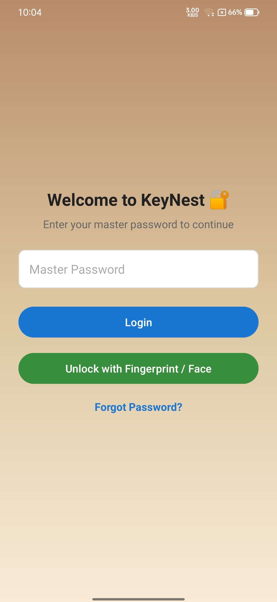
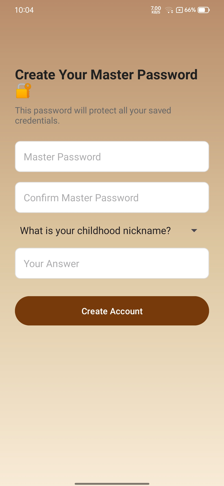
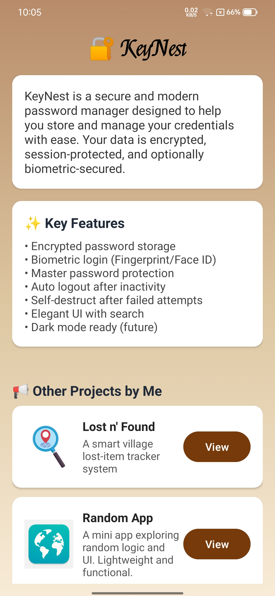
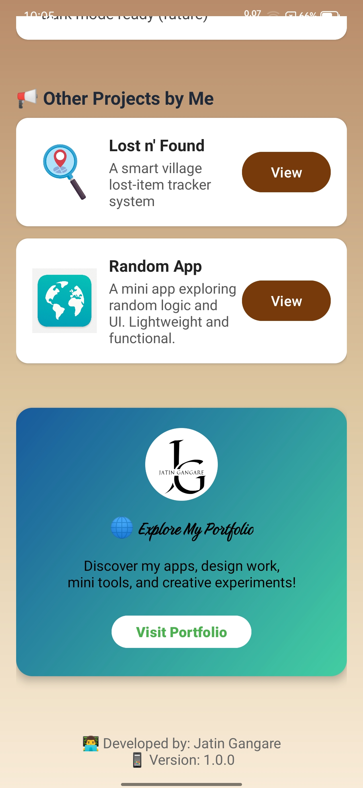

# 🔐 KeyNest - Android Password Manager

KeyNest is a secure, elegant, and lightweight Android password manager that helps you store, manage, and protect your login credentials. Designed with modern UI principles and security features, it's the perfect companion for managing your digital life.

---

## 🚀 Features

- 🔐 Encrypted local password storage using Android Keystore (planned)
- 👆 Biometric login support (Fingerprint/Face ID)
- 🔒 Master password protection with auto logout
- ⏳ Session timeout handling with optional self-destruct (after failed attempts)
- 🌙 Dark mode toggle (coming soon)
- 🔎 Search feature to quickly find saved passwords
- 📦 Modern, card-based UI with gradient support
- 🧠 Fully offline and local-first design (no data leaves your device)
- 🚫 Screenshots are disabled for security
- 🕶 App screen goes blank in Recents

---

## 📱 Screenshots

### 🔐 Login Screen


### 📝 Create Account


### 📖 About Page




---

## 🛠 Tech Stack

- **Language:** Java
- **Framework:** Android SDK (API 21+)
- **UI:** Material Components, CardView, ConstraintLayout
- **Security:** AndroidX Security library (EncryptedSharedPreferences - planned)
- **Other:** SharedPreferences, RecyclerView

---

## 📂 Project Structure

```
KeyNest/
├── app/
│   ├── java/com/jatin/keynest/
│   │   ├── activities/
│   │   ├── adapters/
│   │   ├── models/
│   │   ├── utils/
│   ├── res/
│   │   ├── layout/
│   │   ├── drawable/
│   │   ├── values/
│   │   ├── font/
├── .gitignore
├── README.md
└── build.gradle
```


---

## 🛡 Security Notes

KeyNest stores your passwords **only on your device** using `SharedPreferences`.

> ⚠️ In future versions, EncryptedSharedPreferences and biometric + PIN fallback will be enforced.

---

## 🧪 Current Status

🔧 This project is under active development and is being shared on [LinkedIn](https://www.linkedin.com) as part of my Android development journey.

✅ Biometric Login, Add/View Passwords implemented  
🚧 Dark mode, full encryption pending

---

## 🌐 Portfolio

🔗 [Visit My Portfolio](https://jatin-gangare.netlify.app/)  
📱 [Lost n' Found App](https://github.com/jatin-gangare/lostnfound) – Smart village lost item tracking system

---

## 👨‍💻 Developed By

**Jatin Gangare**  
📍 Maharashtra, India  
📧 jatingangare44@gmail.com

---

## 📄 License

This project is open source and available under the [MIT License](LICENSE).
